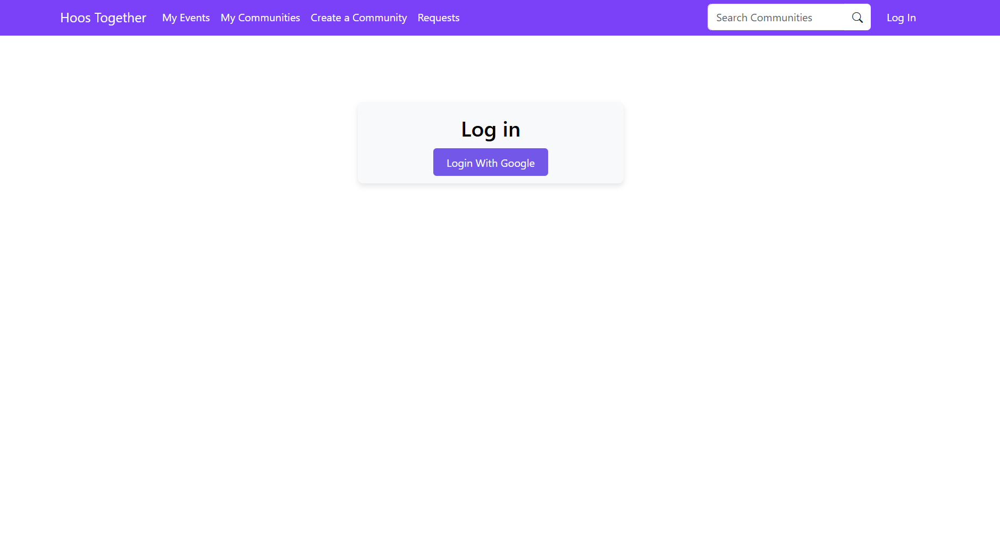
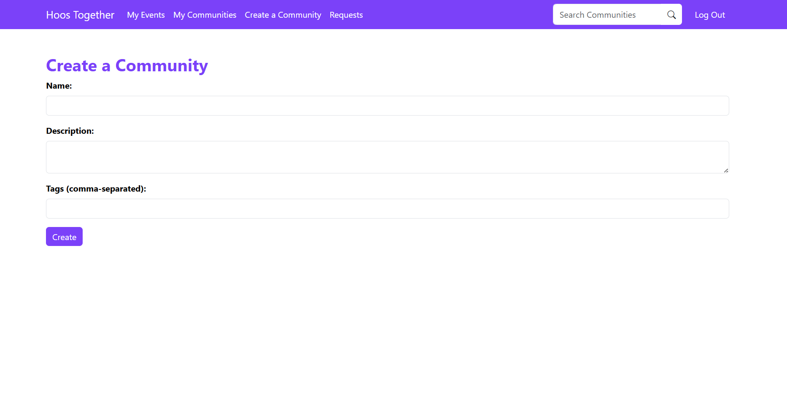
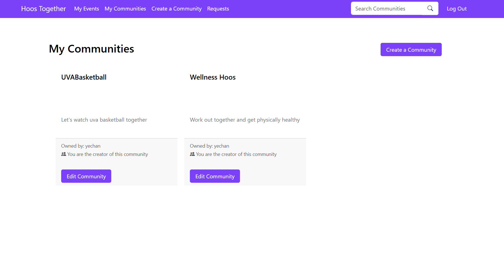
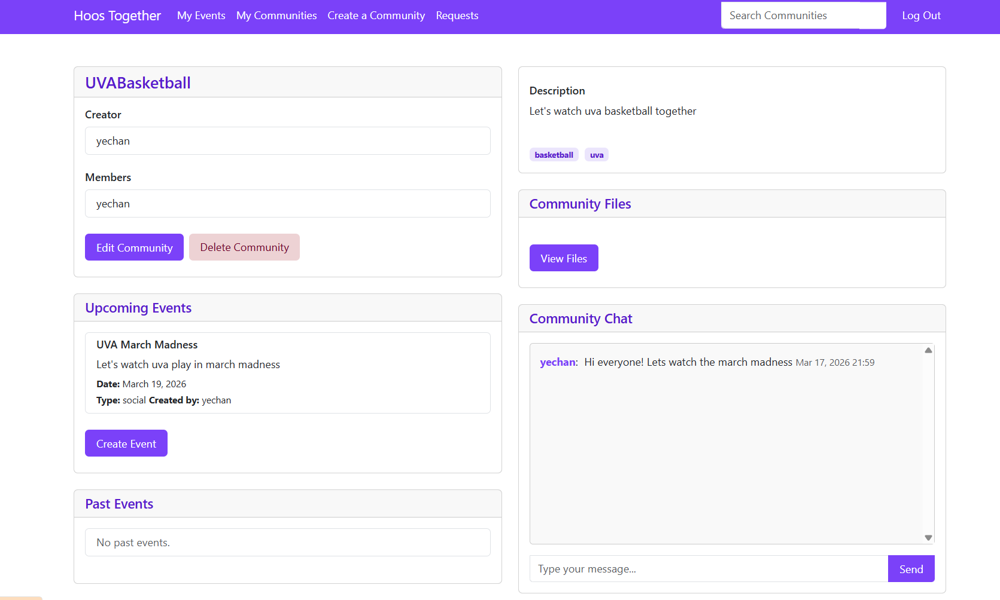
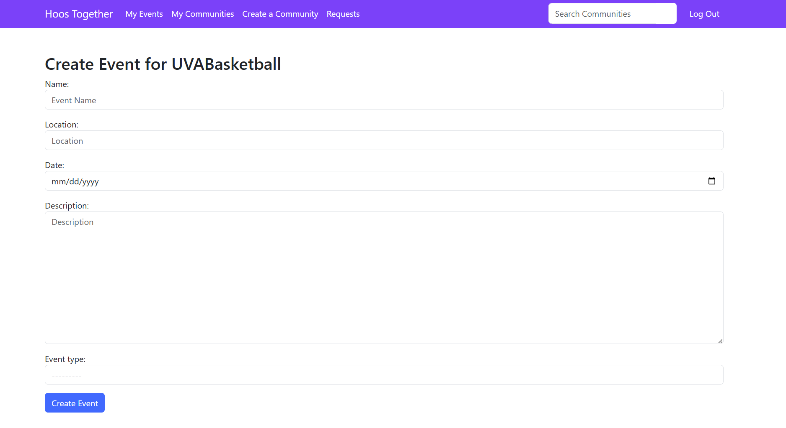
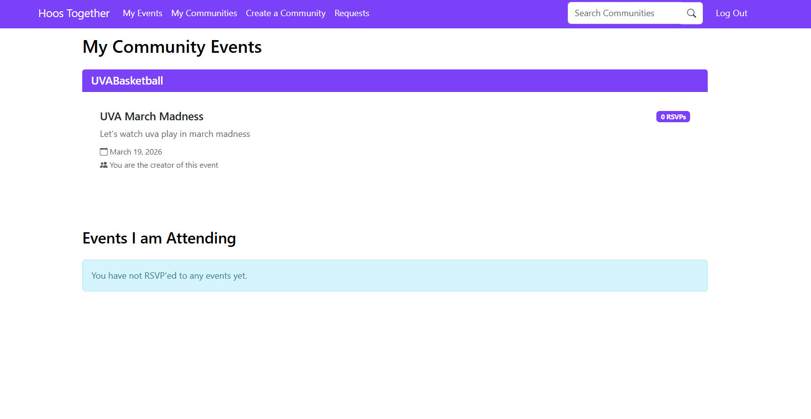

#  Hoos Together — UVA Community Platform
 
A web application built for UVA students to create and join interest-based communities, plan events, share files, and chat with fellow members in real time.
 
> Built with Django · Google OAuth · PostgreSQL · Heroku  
 
---
 
## Table of Contents
 
- [About](#about)
- [Features](#features)
- [Pages & Screenshots](#pages--screenshots)
- [Tech Stack](#tech-stack)
- [Getting Started](#getting-started)
- [Project Structure](#project-structure)
- [Contributors](#contributors)
 
---
 
## About
 
**Hoos Together** is a community-driven platform designed for University of Virginia students. Users can create communities around shared interests, organize upcoming events, upload and share files within their groups, and communicate through a built-in real-time chat. The app uses Google OAuth for seamless authentication tied to university accounts.
 
---
 
## Features
 
- **Google OAuth Login** — Secure, one-click sign-in using Google accounts
- **Create & Manage Communities** — Start a community with a name, description, and tags
- **Community Search** — Find and discover communities by keyword
- **Event Planning** — Create events within communities with name, location, date, description, and event type
- **RSVP System** — RSVP to upcoming events and track attendance
- **Community Chat** — Real-time messaging within each community
- **File Sharing** — Upload and share files with community members
- **Membership Management** — View members, edit communities, or delete them as the creator
- **Join Requests** — Request to join communities and manage incoming requests
 
---
 
## Pages & Screenshots
 
### Login Page
Users sign in with their Google account for quick and secure access.
 

 
---
 
### Create a Community
Start a new community by providing a name, description, and comma-separated tags.
 

 
---
 
### My Communities
View all communities you own or belong to, with quick access to edit them.
 

 
---
 
### Community Detail Page
The main hub for each community — see members, description, tags, upcoming events, past events, shared files, and the community chat.
 

 
---
 
### Create Event
Plan events within a community by specifying the name, location, date, description, and event type.
 

 
---
 
### My Community Events
Track all events across your communities and see which events you've RSVP'd to.
 

 
---
 
## Tech Stack
 
| Layer        | Technology                        |
|--------------|-----------------------------------|
| Backend      | Python, Django 5.1                |
| Frontend     | HTML, CSS, JavaScript             |
| Auth         | Google OAuth via django-allauth   |
| Database     | PostgreSQL (Heroku) / SQLite (local) |
| File Storage | AWS S3 via django-storages + boto3 |
| Deployment   | Heroku with Gunicorn              |
| CI/CD        | GitHub Actions                    |
 
---
 
## Getting Started
 
### Prerequisites
 
- Python 3.10+
- pip
- Git
 
### Installation
 
```bash
# Clone the repository
git clone https://github.com/yechankim0531/uvacommunity.git
cd uvacommunity
 
# Create a virtual environment
python -m venv venv
 
# Activate it
# Windows:
venv\Scripts\activate
# macOS/Linux:
source venv/bin/activate
 
# Install dependencies
pip install -r requirements.txt
```
 
### Local Database Setup
 
The project is configured for Heroku's PostgreSQL by default. To run locally with SQLite, update `settings.py`:
 
1. Change the `DATABASES` setting to:
```python
DATABASES = {
    'default': {
        'ENGINE': 'django.db.backends.sqlite3',
        'NAME': BASE_DIR / 'db.sqlite3',
    }
}
```
 
2. Comment out the `django_heroku` line at the bottom of `settings.py`:
```python
# django_heroku.settings(locals())
```
 
### Run the App
 
```bash
python manage.py migrate
python manage.py runserver
```
 
Then visit **http://127.0.0.1:8000** in your browser.
 
> **Note:** Google OAuth login requires configuring Google API credentials. For local testing, you can create a Django superuser with `python manage.py createsuperuser` and log in via the admin panel at `/admin`.
 
---
 
## Project Structure
 
```
uvacommunity/
├── eventplanning/       # Main Django project settings & config
├── landing/             # Landing/home page app
├── users/               # User authentication & profiles
├── static/              # Static files (CSS, JS, images)
├── .github/workflows/   # CI/CD pipeline
├── manage.py            # Django management script
├── requirements.txt     # Python dependencies
├── Procfile             # Heroku deployment config
└── README.md
```
 
---
